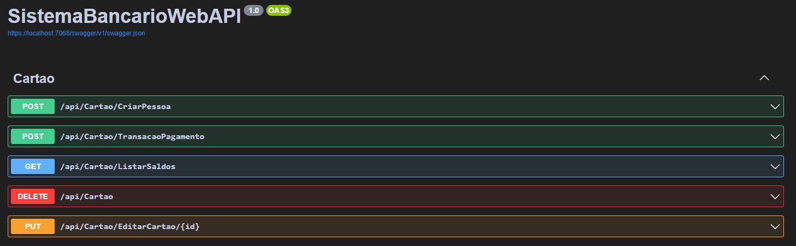

## Sobre o Projeto
O desenvolvimento desse projeto buscou aprimorar os conhecimentos na criação de uma API Rest e aprofundar os conhecimentos nas tecnologias usadas.

O Projeto conta com 5 Endpoints, todos documentados através do swagger:



O endpoint `CriarPessoa` do tipo `POST` consiste na criação de um usuário, onde é necessário passar as seguintes informações:
```
{
    "nome": "string",
    "cpf": "string",
    "numeroCartao": "string",
    "numeroContaCorrente": "string",
    "cvv": "string",
    "saldoContaCorrente": "decimal",
    "dataValidadeCartao": "mm/dd/yyyy"
}
```

O endpoint `TransacaoPagamento` do tipo `POST` consiste na Transferência de pagamento após uma compra. Para que a transação seja efetuada, é preciso que os dados inseridos correspondam aos dados cadastrados no banco, assim como é necessário ter saldo suficiente para que ocorra.

 Para efetuar a transação, os dados necessários são:
```
{
    "numeroCartao": "string",
    "numeroContaCorrente": "string",
    "cvv": "string",
    "dataValidadeCartao": "01/01/2024",
    "valorCompra": "decimal",
    "formaPagamento": ["debito", "credito"],
    "dataCompra": "mm/dd/yyyy"
}
```

O endpoint `ListarSaldos` do tipo `GET` consiste na listagem dos saldos de todos os usuários. O endpoint retorna:

```
{
    "nome": "string",
    "saldo": "decimal",
}
```

O endpoint `EditarCartao` consiste na edição das informações do cartão, onde é necessário passar as seguintes informações:

```
{
    "numeroCartao": "string",
    "cvv": "string",
    "dataValidadeCartao": "mm/dd/yyyy",
}
```

O endpoint `DELETE` consiste na exclusão de uma pessoa do banco de dados.


## Tecnologias Usadas
* .Net 6.0 | C# | ASP.NET
* Entity Framework
* SQL Server

## Tabelas do Banco de Dados

### Relacionamento das tabelas
#### O relacionamento entre as tabelas foi feito seguindo essa linha de lógica e raciocinio: 

Uma **pessoa** possui apenas um cartão, e um **cartão** só pertence a uma **pessoa específica**;

Um **cartão** só possui uma **conta corrente**, e uma **conta corrente** só pertence a uma **pessoa específica**.

Uma **conta corrente** só possui um **saldo**, e um **saldo** só pertence a uma **conta corrente específica**.


## Instalação
1. Clone o repositório usando o comando:
```
$ git clone https://github.com/Bruno0M/SistemaBancarioWebAPI.git
````

2. Acesse a pasta do seu projeto e então abra em sua IDE de preferência:
```
$ cd SistemaBancarioWebAPI
```